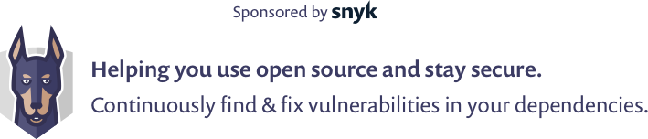

= The Secure Developer User Group!
:page-title: The Secure Developer
:page-description: The Secure Developer
:icons: font
:experimental:

== LIVE SESSION

==== Zip Slip - A live exploit

{nbsp} +

video::l1MT5lr4p9o[youtube, width=100%, height=640]

.Video Quality
[NOTE]
For best results, select the highest video resolution in the embedded YouTube settings (click settings cog).

{nbsp} +
{nbsp} +

{nbsp} +
{nbsp} +

== FUTURE SESSIONS
++++

To be announced...

++++

{nbsp} +

== PAST SESSIONS
++++
<iframe src='https://cdn.knightlab.com/libs/timeline3/latest/embed/index.html?source=1vdgZM9XIPUlDGURN9uABC7cILvuIfpyEOurETMjOloY&font=OpenSans-GentiumBook&lang=en&start_at_end=true&initial_zoom=2&height=650' width='100%' height='650' webkitallowfullscreen mozallowfullscreen allowfullscreen frameborder='0'></iframe>
++++

{nbsp} +

== PODCAST
{nbsp} +
++++
<iframe src='https://cdn.knightlab.com/libs/timeline3/latest/embed/index.html?source=1e_bzDpT0RSVlNDENK9sVo9it5J-RPGluxM6QunRJ6VY&font=Default&lang=en&start_at_end=true&initial_zoom=2&height=650' width='100%' height='650' webkitallowfullscreen mozallowfullscreen allowfullscreen frameborder='0'></iframe>
++++

{nbsp} +
